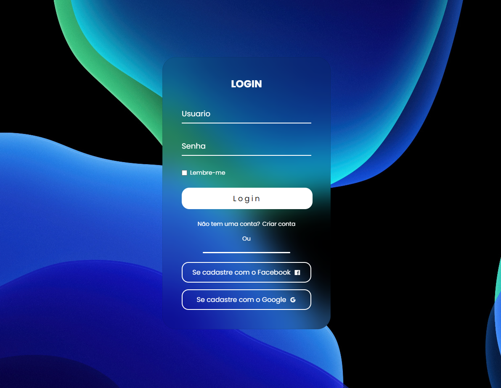

# Estudo (PAGINA DE LOGIN)

Um estudo de criação de uma página de login moderna.

---

## Tecnologias e Ferramentas

O site foi construído utilizando as seguintes tecnologias

- **HTML & CSS**: Para estruturação e estilização responsiva do site.
- **JavaScript**: Usado para criar interatividade e funcionalidades dinâmicas.
- **Boxicons**: Para ícones estilizados e de fácil implementação.

---

## Contato

- **Site**: [VW Developer](https://vwdeveloper.netlify.app/#inicio)
- **LinkedIn**: [Vinícius Wilker](https://www.linkedin.com/in/viniciuswilkerdev/)
- **WhatsApp**: (11) 94589-7179